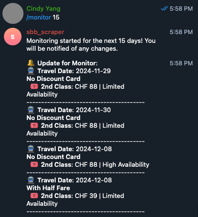

# sbb-scraper

## Overview
The `sbb-scraper` project is designed to notify people of the latest promotions that SBB offers. It includes various sub-projects, one of which is the Commune Day Pass Monitor Bot. This bot monitors the availability of SBB day passes and notifies users of any changes.

## Features
- Notify users of the latest SBB promotions
- Monitor availability of SBB commune day passes
- Receive notifications in Markdown format
---
## Commune Saver Day Pass Monitor Bot

### Overview
The Commune Saver Day Pass Monitor Bot is a Telegram bot that monitors the availability of [SBB commune day passes](https://www.cartejournaliere-commune.ch/en#terms) and notifies users of any changes. Users can set up monitoring for specific date ranges and receive updates every 24 hours.

The SBB Commune Saver Day Pass offers discounted prices when purchased in advance. The pass is available at lower prices 6 months to 10 days before travel, with prices increasing depending on availability. The bot helps track these price fluctuations, ensuring you get the best deal.

Price details:

- Lower prices (6 months to 10 days before travel):
No discount - 2nd class: 52, No discount - 1st class: 88, Half-fare - 2nd class: 39, Half-fare - 1st class: 66
- Higher prices (closer to travel date):
No discount - 2nd class: 88, No discount - 1st class: 148, Half-fare - 2nd class: 59, Half-fare - 1st class: 99

<p align="center">
  
</p>

### Features
- Check availability for specific date ranges
- Monitor availability and receive updates every 24 hours
- Start and stop monitoring
- Receive notifications in Markdown format

### Commands
- `/start` - Start the bot and get a welcome message
- `/help` - Show available commands
- `/check <start date (YYYY-MM-DD)> <days to check>` - Check the price and availability for a specific range of dates. For example: `/check 2024-12-25 10` will check availability and pricing from December 25, 2024, for the next 10 days.
- `/monitor <days to check>` - Set a monitor for a specific range starting from today. The bot will track changes in availability or price for the next N days and notify you of any abnormalities (e.g., price spikes or drops). If you don't stop it, the monitor will continue to send updates.
- `/stop_monitor` - Stop receiving updates and disable the monitoring feature.

### Installation
1. Clone the repository:
    ```sh
    git clone https://github.com/yourusername/sbb-scraper.git
    cd sbb-scraper
    ```

2. Create and activate a virtual environment:
    ```sh
    python3 -m venv venv
    source venv/bin/activate  # On Windows use `venv\Scripts\activate`
    ```

3. Install the required dependencies:
    ```sh
    pip install -r requirements.txt
    ```
    - Note that this requirements.txt can be auto-generated by command `pip-compile requirement.in`, just need to add all direct dependencies in **requirement.in** and run the above command.


4. Create a `.env` file in the root directory and add your Telegram bot token:
    ```env
    TELEGRAM_BOT_TOKEN=your_telegram_bot_token
    ```

### Usage
1. Run the bot:
    ```sh
    cd commune_daypass
    python3 main.py
    ```

2. Interact with the bot on Telegram using the available commands.


